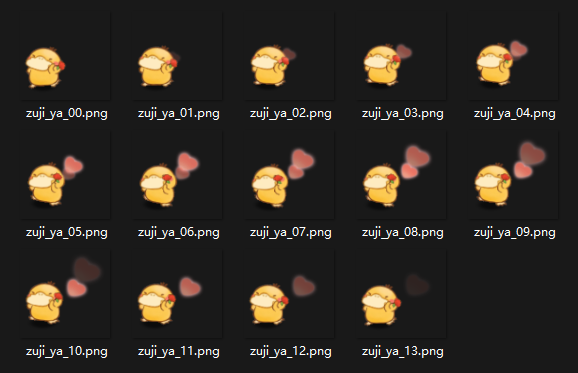

# PackSF

序列帧合图工具。

名称解释：
- Pack = 打包
- S = Sequence = 序列
- F = Frame = 帧

假如你想把序列帧碎图打成合图（图集），那么你来对地方了。

这是一堆序列帧碎图：

打成合图之后：

本工具基于 .net 开发，使用的第三方插件：
- [SixLabors.ImageSharp](https://www.nuget.org/packages/SixLabors.ImageSharp)
- [Utf8Json](https://www.nuget.org/packages/Utf8Json)

我的邮箱：klk0@qq.com